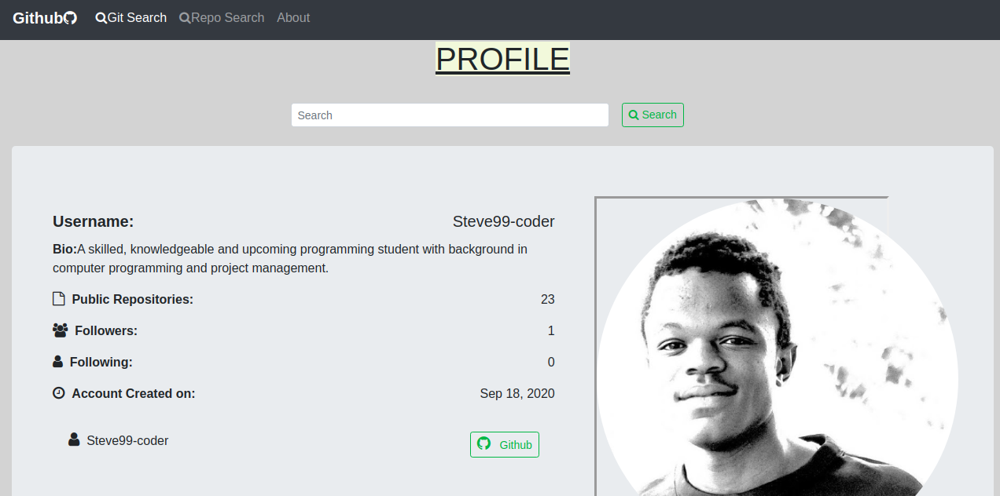

# Project Name
Github Search

## Author
Stephen Nderitu

## Project Image

## Project Description
This is a website where users may enter a GitHub username into a form, submit it, and see names and descriptions of that person's public repositories. A person can also look for repositories in the form for search repositories.

## BDD:
| Action |  Input    | Output       |
| :-------------:         |    :-------------: |      :-------------:    |
| Search Github Username   | `Your Github Name`| `Your Github Account and Repository` |
| Search Github Repository    | `Any Repository Name`   | `All Repositories with the search Names`|

### Live Link

* https://Steve99-coder.github.io/Git-Search/

## Technologies Used
* CSS
* HTML5
* Bootstrap
* Angular CLI

## Installation

### Step 1:

* install node js [here](https://nodejs.org/en/).

* Install angular with angular cli.[guide](https://codeburst.io/how-to-build-an-angular-app-with-angular-cli-in-a-couple-of-minutes-43089d3ab272) with worked well for me

### Step 2: 

* git clone https://github.com/Steve99-coder/Git-Search.git to your terminal and execute it by opening with vsCode or any other IDE of your choice.

### Step 3:
Run `ng serve` for a dev server. Navigate to `http://localhost:4200/`. The app will automatically reload if you change any of the source files.

## License

Copyright <2020> <Stephen Nderitu>

Permission is hereby granted, free of charge, to any person obtaining a copy of this software and associated documentation files (the "Software"), to deal in the Software without restriction, including without limitation the rights to use, copy, modify, merge, publish, distribute, sublicense, and/or sell copies of the Software, and to permit persons to whom the Software is furnished to do so, subject to the following conditions:

The above copyright notice and this permission notice shall be included in all copies or substantial portions of the Software.

THE SOFTWARE IS PROVIDED "AS IS", WITHOUT WARRANTY OF ANY KIND, EXPRESS OR IMPLIED, INCLUDING BUT NOT LIMITED TO THE WARRANTIES OF MERCHANTABILITY, FITNESS FOR A PARTICULAR PURPOSE AND NONINFRINGEMENT. IN NO EVENT SHALL THE AUTHORS OR COPYRIGHT HOLDERS BE LIABLE FOR ANY CLAIM, DAMAGES OR OTHER LIABILITY, WHETHER IN AN ACTION OF CONTRACT, TORT OR OTHERWISE, ARISING FROM, OUT OF OR IN CONNECTION WITH THE SOFTWARE OR THE USE OR OTHER DEALINGS IN THE SOFTWARE.

